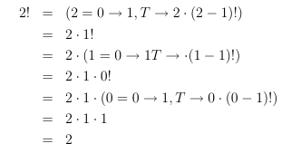

% Recursive Functions of Symbolic Expressions and Their Computation by Machine, Part I
% Matthieu Cneude
% @Cneude_matthieu

# Introduction

## WARNING

* I make mistakes.
    * Sorry if I did!
* Feedback welcome.

## Who's John McCarthy

* TODO
* The part II of this paper has never been written.
     * What

## A bit of context

* LISP and Fortran were written for the IBM 704 (available at MIT).
    * "Only computer which can handle complex math" - Wikipedia
* Only Fortran older than LISP.
    * One of the oldest high level programming language (non-assembly language).
* Today, LISP is a family of languages
    * Many "dialects*
    * This paper is the foundation of all of these languages... and more (JINGLE!).

## IBM 704

## Good Old Languages

* IPL2 (1956) - List processing in Assembly.
* Fortran (1957) - No list processing
* LISP (for LISt Processing) (1962?)

## Goals of LISP

* AI (term coined by McCarthy)
    * They thought they were almost there in the 50s / 60s.
    * McCarthy wrote a "funny paper" later "HUMAN-LEVEL AI IS HARDER THAN IT SEEMED IN 1955" (
* Chess player (beginning of CS game theory).
* Programming the Advice Taker (proposed in 1958).

* ... what about for people to understand? (*MORE ON THAT LATER*)

# The Paper

## Advice Taker

> "representing information about the world by sentences in a suitable formal language and a reasoning program that would decide what to do by making logical inferences. Representing sentences by list structure seemed appropriate - it still is - and a list processing language also seemed appropriate for programming the operations
involved in deduction - and still is." - McCarthy, 1979

* From the paper: LISP handle declarative and imperative sentences.

## S-Expression and M-expressions

### S-Expression (paper)

Characters: `(` `.` `)`

| (CAR(CONS,x,y))
| (CDR(CONS,x,y))

### M-Expression (paper, never implemented)

| car [cons [x; y]] = x
| cdr [cons [x; y]] = y

### Actual code (Scheme)

| (car (cons x y))
| (cdr (cons x y))

## Recursion

* Describe formalism for defining function recursively.
* First programming language with recursion.

## Conditionals

* Invented conditional expression from propositional logic
    * Predicate: function returning #T or #F
* Idea of conditional in programming introduced here (not present in Assembly)

## Functions

* Precise that it's **not** the usual mathematics term "function".
    * Same input potentially lead to different output.
* Inspired by Church’s lambda-notation (1936).
    * Turing Machine (1936) "too complicated".

## Linked List (basic data structure)

### Modern LISP (Scheme)
| `(car (cons x y))`
| `(cdr (cons x y))`

### Pointer diagram
| `(cons 42 (cons 69 613)))`

## SRSLY?

* IBM 704 haunting even most modern LISP

| `caddr[x] for car[cdr[cdr[x]]`
| `(caddr x) equivalent to (car (cdr (cdr x))))`

* About not using single letter for atomic symbol like in mathematics:

> "Second, it is convenient to allow English words and phrases to stand for atomic entities for mnemonic reasons" - John McCarthy (paper)

* ... what about 

### Lists

* List data structure
* car / cdr from IBM 704
    * Curse following us till NOW

# Legacy

## The most important

* First functional programming language
* Smalltalk (70s) was very influenced by LISP (today: Pharo)
    * One rule
    * Garbage collection
    * ... but don't like special forms

## LISP today

* Common LISP
* Emacs LISP
* Clojure
* Scheme

## References

* Slides TODO
* [HUMAN-LEVEL AI IS HARDER THAN IT SEEMED IN 1955](http://www-formal.stanford.edu/jmc/slides/wrong/wrong-sli/wrong-sli.html)
* kk
