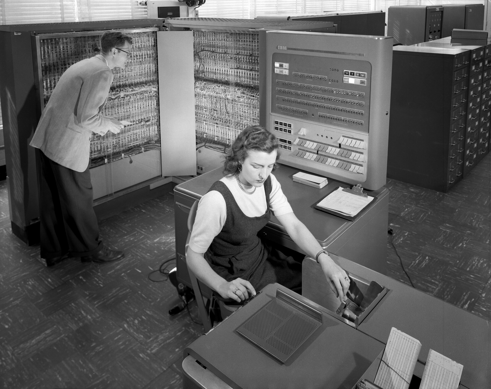

% Recursive Functions of Symbolic Expressions and Their Computation by Machine, Part I
% Matthieu Cneude
% @Cneude_Matthieu

# Introduction

## WARNING

* I make mistakes.
    * Sorry if I did!
* Feedback welcome.

## John McCarthy?

* Born September 4, 1927 in Boston, Massachusetts.
* Pioneer who contributed to AI, Internet, the web.
* At MIT from 1958 to 1962 (then Standford university).
* A. M. Turing Award from Association for Computing Machinery, 1971.
* "He flew planes, climbed mountains, and traveled to the Soviet Union and China in the 1960s and 70s at a time when it was a major challenge."

## A bit of Context

* Paper is from 1960.
* The part II of this paper has never been written.
* Lisp and Fortran were written for the IBM 704 (available at MIT).
    * "Only computer which can handle complex math" - Wikipedia
* Second oldest high level programming language (non-assembly language).
    * Only Fortran older than Lisp.
* Today, Lisp is a family of languages
    * Many "dialects"
    * This paper is the foundation of all of these languages... and more (JINGLE!).

## IBM 704



## Good Old Languages

* IPL2 (1956) - List processing in Assembly.
* Fortran (1957) - No list processing
* Lisp (for LISt Processing) (1959-1962?)

## Why Lisp?

* AI (term coined by McCarthy)
    * They thought they were almost there in the 50s / 60s.
    * McCarthy wrote a "funny paper" later "HUMAN-LEVEL AI IS HARDER THAN IT SEEMED IN 1955"
    * Chess player (beginning of CS game theory).
* "Mathematical language".
* Programming the Advice Taker (proposed in 1958).

# The Paper

## Advice Taker

> "representing information about the world by sentences in a suitable formal language and a reasoning program that would decide what to do by making logical inferences. Representing sentences by list structure seemed appropriate - it still is - and a list processing language also seemed appropriate for programming the operations
involved in deduction - and still is." - McCarthy, 1979

* From the paper: Lisp handle declarative and imperative sentences using lists.

## The notation: S-Expression and M-expressions

### S-Expression (paper)

Characters: `(` `.` `)`

| (CAR(CONS,x,y))
| (CDR(CONS,x,y))

### M-Expression (paper, never implemented)

| car [cons [x; y]] = x
| cdr [cons [x; y]] = y

### Actual code (Scheme - dialect of Lisp)

| (car (cons x y))
| (cdr (cons x y))

## Functions

* Functions first class citizen (code as data)
* Precise that it's **not** the usual mathematics term "function".
* Inspired by Church’s lambda-notation (1936).
    * Turing Machine (1936) "too complicated".
* Use of lambda expression as bedrock for computation.
* Function composition to create new function.

### Example (Scheme)

```
(+ 2 3)
(apply + '(1 2))
((lambda (x) (+ x x)) 2)
```

## Recursion

* Describe formalism for defining function recursively.
* First programming language with recursion.

### Example (Scheme)

```
(define (factorial n)
    (if (= n 0)
        1
        (* n (factorial (- n 1))) ))
```

## Conditionals

* First use of conditional expressions in a programming language.
    * Predicates: function returning #T or #F.
    * Essential for testing recursive base cases.
* Fortran had IF but it was "very awkward to use" - McCarthy 1979.

### Example (Scheme)
```
(cond ((equal? x "#t") #t)
	((equal? x "#f") #f)
	(else x))
```

## Linked List (basic data structure)

### Modern Lisp (Scheme)
| `(car (cons x y))`
| `(cdr (cons x y))`

### Box and Pointer diagram
| `(cons 42 (cons 69 (cons 613 '()))`


## ???

* car? cdr? WAT???
    * Nice heritage from IBM 704 memory access.

| `caddr[x] for car[cdr[cdr[x]]`
| `(caddr x) for (car (cdr (cdr x))))`

* About functions which have not one letter

> " ... is convenient to allow English words and phrases to stand for atomic entities for mnemonic reasons" - John McCarthy (paper)

* ... what about other programmers?

## Garbage collection

> "... formerly pointed cannot be reached by a car − cdr chain from any base register. Such a register may be considered abandoned by the program because its contents can no longer be found by any possible program; hence its contents are no longer of interest, and so we would like to have it back on the free-storage list. This comes about in the following way.  Nothing happens until the program runs out of free storage. When a free register is wanted, and there is none left on the free-storage list, a reclamation cycle starts.

## Apply and Eval

* "Universal S-Function apply"
    * Universal turing machine
    * `apply[f ; args] = eval[cons[f ; appq[args]]; NIL],`

> "Writing eval required inventing a notation representing LISP functions as LISP data, and such a notation was devised for the purposes of the paper with no thought that it would be used to express LISP programs in practice" - McCarthy, 1979

## Apply (Lisp Programmer's Manual 1.5)


## Eval (Lisp Programmer's Manual 1.5)


## Eval (Scheme)

```
(define (eval exp env)
  (cond ((self-evaluating? exp) exp)
        ((variable? exp) (lookup-variable-value exp env))
        ((quoted? exp) (text-of-quotation exp))
        ((assignment? exp) (eval-assignment exp env))
        ((definition? exp) (eval-definition exp env))
        ((if? exp) (eval-if exp env))
        ((lambda? exp)
         (make-procedure (lambda-parameters exp)
                         (lambda-body exp)
                         env))
        ((begin? exp) 
         (eval-sequence (begin-actions exp) env))
        ((cond? exp) (eval (cond->if exp) env))
        ((application? exp)
         (apply (eval (operator exp) env)
                (list-of-values (operands exp) env)))
        (else
         (error "Unknown expression type -- EVAL" exp))))

```

## Apply (Scheme)

```
(define (apply procedure arguments)
  (cond ((primitive-procedure? procedure)
         (apply-primitive-procedure procedure arguments))
        ((compound-procedure? procedure)
         (eval-sequence
           (procedure-body procedure)
           (extend-environment
             (procedure-parameters procedure)
             arguments
             (procedure-environment procedure))))
        (else
         (error
          "Unknown procedure type -- APPLY" procedure))))
```

# Legacy

## The most important

* Everything we saw before (recursion, conditionals, lambdas...).
    * Lambdas implemented in mainstream programming languages (Java, C#, C++ ...).
* First functional programming language.
* Smalltalk (70s) was very influenced by Lisp (today: Pharo).
    * One of the first OOP language.
    * One rule "almost everything is function" was appealing to Alan Kay.
        * In smalltalk, everything is an object.
    * Garbage collection.

## Lisp today

* Clojure
* Common Lisp
* Emacs Lisp
* Scheme

## References

* [Slides - https://github.com/Phantas0s/presentations/](https://github.com/Phantas0s/presentations/)
* [HUMAN-LEVEL AI IS HARDER THAN IT SEEMED IN 1955](http://www-formal.stanford.edu/jmc/slides/wrong/wrong-sli/wrong-sli.html)
* [History of Lisp](http://jmc.stanford.edu/articles/lisp/lisp.pdf) 
* [Page on John McCarty (all papers)](http://jmc.stanford.edu/)
* [xkcd](https://imgs.xkcd.com/comics/lisp_cycles.png)
